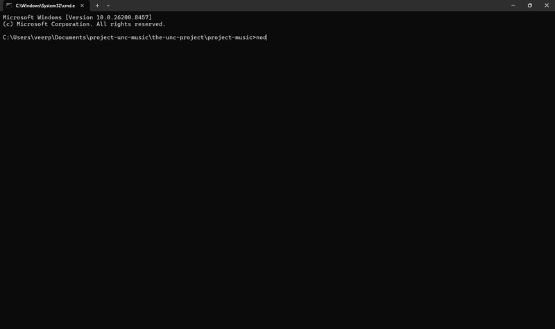

# Audiofy 🎵

> Download music/any audio from straight from your terminal.

## Install

npm install -g audiofy

## Requirements

- Node.js (nodejs.org)

## Usage

audiofy

## Features

- 🎵 Download a single song
- 📋 Download a list of songs
- 🔗 Download a YouTube playlist
- 📁 Custom save location
- 🎚️ Adjustable MP3 quality (320k/192k/128k)
- ⚡ yt-dlp auto downloads on first run
- 🖥️ Windows, Mac, Linux supported

## Notes

- First run downloads yt-dlp automatically
- Songs saved to ./music by default
- Change save location in Settings
